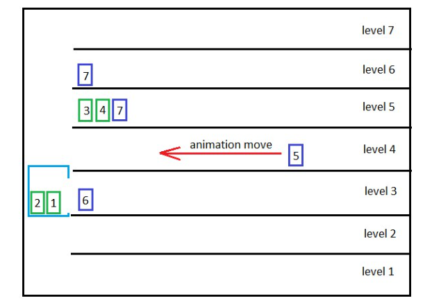

# Elevator Simulation

TypeScript simulation of an elevator using PIXI.js and Tween.js.

## Features

Є будинок із N кількістю поверхів.

В лівій стороні будівлі знаходиться ліфт. Місткість ліфту C людей.
Ліфт може перевозити людей вгору і вниз, але не може везти людей вгору, якщо їм потрібно вниз (і навпаки).
Люди (рандомно, одна людина в інтервалі 4-10 сек на кожному поверсі) виходять із правої сторони будівлі та йдуть коридором до ліфта.
Люди, які прибули на свій поверх, рухаються від ліфта до правої сторони будівлі і там ховаються.
Швидкість руху ліфта 1 поверх за секунду.
Час зупинки ліфта для завантаження людей 800 мс




## Setup

```bash
npm install
npm run dev
```
